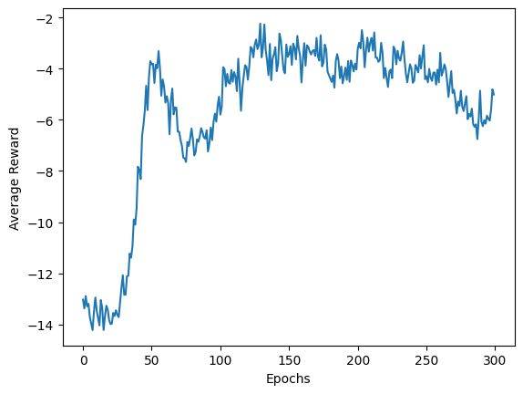

# Training open-source LLMs using RLHF

This project focuses on the fine-tuning of large language models via Reinforcement Learning with Human Feedback (RLHF). Our primary objective is to enhance Google's [Text to Text Transfer Transformer (T5)](https://github.com/google-research/text-to-text-transfer-transformer) model using the [OpenHermesPreferences dataset](https://huggingface.co/datasets/argilla/OpenHermesPreferences). For the optimization process, we employ [Proximal Policy Optimization (PPO)](https://arxiv.org/abs/1707.06347) to refine the model's performance in generating text that aligns more closely with human preferences and values. We used [PairRM](https://huggingface.co/llm-blender/PairRM) as the reward model.


Ref: [https://huggingface.co/blog/rlhf](https://huggingface.co/blog/rlhf)

## Setup

1. Clone this repository:

   ```bash
   git clone https://github.com/gtamer2/rl_final_project.git
   ```

2. Install the dependencies:

   ```bash
   pip install -r requirements.txt
   ```

## Model Training

Execute the training script with the following command:

```bash
python main.py --model_name="google-t5/t5-small" --batch_size=32 --epochs=200 --mode="train"
```

### Parameters

- `batch_size`: Batch size for training.
- `epochs`: Number of training epochs.
- `model_name`: LLM Model.
- `lr`: Learning rate for the optimizer.
- `model_save_path`: Path to save the trained model.
- `rewards_save_path`: Path to save the rewards.
- `dataset_size`: Number of data samples (Use `-1` to train on the entire dataset)
- `seed`

## Visualize Reward Curve

To visualize the reward curve, use the following command:

```bash
python main.py --rewards_save_path="reward.npy" --mode="visualize"
```

<!-- ## Example Predictions

Ground Truth (Top), Predictions (Bottom):

 -->

## Evaluation Curves

Average Reward Curve:



## Team Members

- [Kushaan Gowda](https://github.com/kushaangowda)
- [George Tamer](https://github.com/gtamer2)